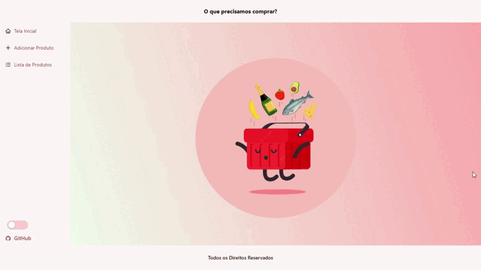
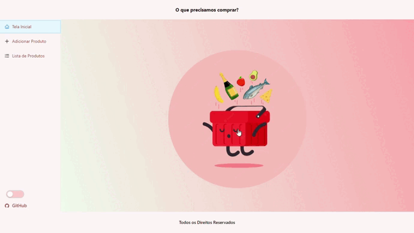
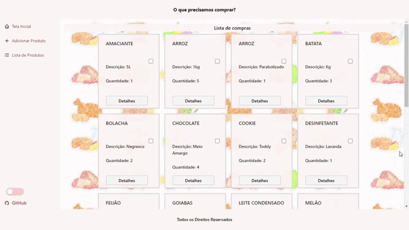
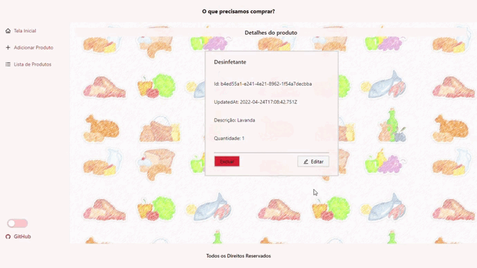
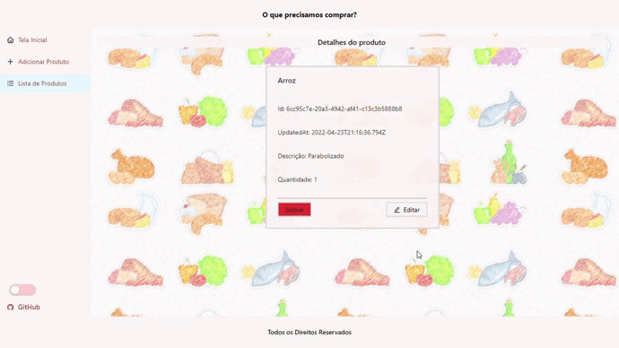
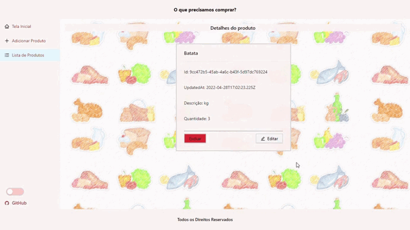
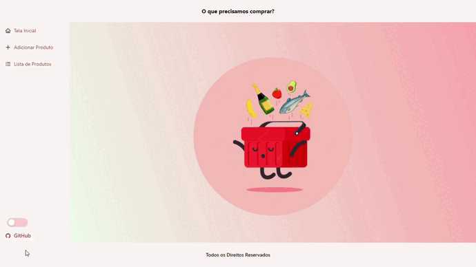

# Como utilizar sua Nova Lista de Compras!

## Nesse projeto, você pode:

### `1. Acessar sua lista de compras:`

- Está vendo essa logo redondinha? Essa cestinha mesmo, logo à sua frente, clique nela! ;D.
- Ou se preferir pode acessá-la no menu lateral, ali no cantinho esquerdo.

 

  

 

### `2. Adicionando um produto:`

- Ali no menuzinho lateral, do lado esquerdo da tela, você pode clicar em **"Adicionar Produtos"**. Feito isso, você está pronto para adicionar todas as coisas que não podem ser equecidas quando for ao mercado.

 

  

 

### `3. Voltando para a lista...`

- Aqui você pode marcar os itens já pegos e acessar os detalhes de cada um.

 

  

 

### `4. Detalhes:`

- Clicando em detalhes você vai parar nessa telinha aí, através dela poderá excluir ou editar seu item.
- Ps.: Não se preocupe, caso clique em EXCLUIR sem querer ainda da para voltar atrás! ;)

 

  

 

### `5. Excluir:`

- Lembra ali no tópico anterior quando eu disse que dava para voltar atrás? Não se engane, se você confirmar a ação no "OK"... aí é 'pra' valer e não da mais para voltar atrás, então preste atenção e tenha firmeza nesses cliques.

 

  

 

### `6. Editar:`

- Depois de acessar a lista e os detalhes, chegamos aqui! Se quando, lááááááá em cima, ao criar um produto para sua lista você errou algo... KEEP CALM, é aqui que arrumamos nossos erros!

 

  

 

#### `Não se esqueça de dois detalhes!`
- O primeiro é o 'botãozinho', é a opção de um tema escuro ou, dependendo das configurações do seu aparelho, claro. Acesse ele no final do menu... lado esquerdo, lembra? :D
- O segundo é acessar meu github (logo abaixo do 'botãozinho' citado acima) e me dar seu feedback \o/! Toda ajuda e comentários são bem-vindos!

 

  

 
 
 

<h3>
-------------------- < Vem.Ser=Dev > Projeto final - A Liga Digital < /Vem.Ser=Dev > --------------------
</h3>

 

<h3>
Obrigada a todos os professores pela paciência, dedicação, empatia e empenho. Vocês com certeza fizeram a diferença!
</h3>

 

> This project was bootstrapped with [Create React App](https://github.com/facebook/create-react-app).